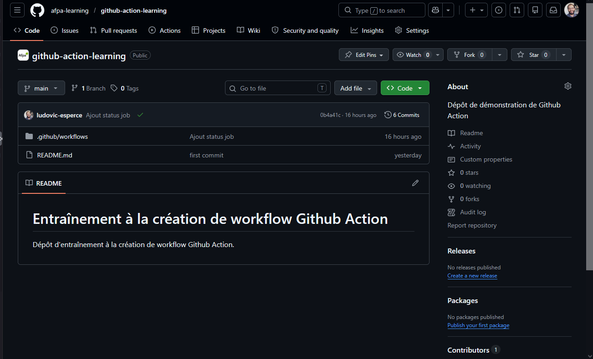

# Entraînement à la création de workflow Github Action

Dépôt d'entraînement à la création de workflow Github Action.

## Etape 1 : création d'un workflow

La procédure suivante permet de créer un premier workflow :
1. créer projet local avec un dossier `.github/workflows`
2. créer un fichier `firt-workflow.yml` dans ce dossier, avec le contenu suivant :
```yml
name : Github Action learning

# Permissions minimales pour le workflow
permissions:
  contents: read

# Il est possible d'utiliser des variables d'environnement en utilisant ${{ <nom-variable> }}
# https://docs.github.com/en/actions/reference/workflows-and-actions/contexts
run-name : ${{ github.actor }} apprentissage de Github Action
on : [push]

jobs:
  Github-action-learning:
    runs-on: ubuntu-24.04
    steps:
      - name: Etape 1 - Là où tout commence
        run: echo "It's alive! ALIIIIIVE!"
```
3. créer un dépôt sur Github et le lier au dépôt local contenant le projet
4. pousser le code sur le dépôt Github

Si tout est bien configurer il devrait être possible d'observer le bon fonctionnement du workflow :



Cycle de vie d'un Workflow :
1. événement
2. recherche du workflow correspondant à l'événement
3. mise en file d'attente
4. attribution d'un "runner"
5. exécution des jobs
6. nettoyage des machines virtuelles