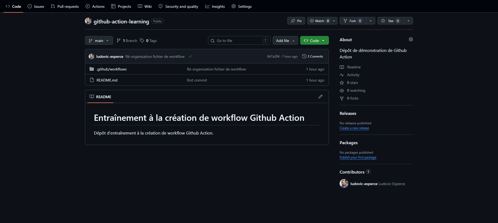

# Entraînement à la création de workflow Github Action

Dépôt d'entraînement à la création de workflow Github Action.

## Etape 1 : création d'un workflow

La procédure suivante permet de créer un premier workflow :
1. créer projet local avec un dossier `.github/workflows`
2. créer un fichier `firt-workflow.yml` dans ce dossier, avec le contenu suivant :
```yml
name : Github Action learning

# Permissions minimales pour le workflow
permissions:
  contents: read

# Il est possible d'utiliser des variables d'environnement en utilisant ${{ <nom-variable> }}
# https://docs.github.com/en/actions/reference/workflows-and-actions/contexts
run-name : ${{ github.actor }} apprentissage de Github Action
on : [push, workflow_dispatch] # se délenche sur un "push" et peut être démarrer manuellemen ("workflow_action")

jobs:
  Github-action-learning:
    runs-on: ubuntu-24.04
    steps:
      - name: Etape 1 - Là où tout commence
        run: echo "It's alive! ALIIIIIVE!"
```
3. créer un dépôt sur Github et le lier au dépôt local contenant le projet
4. pousser le code sur le dépôt Github

Si tout est bien configurer il devrait être possible d'observer le bon fonctionnement du workflow :


Cycle de vie d'un Workflow :
1. événement
2. recherche du workflow correspondant à l'événement
3. mise en file d'attente
4. attribution d'un "runner"
5. exécution des jobs
6. nettoyage des machines virtuelles

## Etape 2 : scripting sur le runner

Il est possible d'ajouter à une étape des commandes qui s'exécuteront sur le "runner".

Au sein de ces commandes, des [variables de contexte](https://docs.github.com/en/actions/reference/workflows-and-actions/contexts) sont fournies par Github Action.

Essayer d'ajouter cette étapes à votre workflow :

```yml
- name: Informations diverses
  - run: echo "Le job a été déclenché par ${{ github.event_name }}"
```

> [!TIP]
> Sous VS Code, il est possible d'utiliser des extensions telles que [GitHub Actions for VS Code](https://marketplace.visualstudio.com/items?itemName=GitHub.vscode-github-actions) pour bénéficier de la coloration syntaxique des variables.

Une fois le workflow poussé l'action se déclenche automatiquement. Il est également possible de déclenche  l'action manuellement :



Il est possible de chaîner les commandes pour les exécuter en 1 seul "run" en utilisant `|`:

```yml
- name: Informations diverses
  run: | # Le | permet de chaîner les commandes
    echo "Le job a été déclenché par ${{ github.event_name }}"
    echo "Ce job tourne sur ${{ runner.os }}"
    echo "La branche est ${{ github.ref }} sur le dépôt ${{ github.repository }}"
```

## Etape 3 : récupération du code sur le runner

Parmi les actions disponibles dans le [Marketplace](https://github.com/marketplace?type=actions) il est possible d'utiliser [Checkout](https://github.com/marketplace/actions/checkout) afin de récupérer un dépôt sur le runner.

Le "checkout" peut s'effectuer avec le code de workflow suivant :

```yml
- name: Récupération du code
  uses : actions/checkout@de0fac2e4500dabe0009e67214ff5f5447ce83dd
```
Recommandation de sécurité : utiliser le SHA du **commit stable** de l'action Github pour cibler l'opération de [checkout](https://github.com/actions/checkout/releases/tag/v6.0.2).

## Etape 4 : mise en place de l'environnement dans le runnner

La suite de cette procédure permet de développer le workflow pour automatiser les tests unitaires d'une application web.

Voici les projets que vous pourrez utiliser (à choisir en fonction du langage de votre choix) :
- [application en Python](https://github.com/ludovic-esperce/taxi-fare/tree/solution);
- application en PHP ;
- application en Java ;
- application en Javascript.

> [!TIP]  
> Il vous sera possible d'implémenter le workflow sur un "fork" du dépôt de votre choix.

### Récupération du code

Il est possible d'utilisation l'action ["checkout"](https://github.com/marketplace/actions/checkout), voici un extrait de configuration YML exploitable :

```yml
steps:
  - name: Checkout code
    uses: actions/checkout@de0fac2e4500dabe0009e67214ff5f5447ce83dd
```

> [!NOTE]  
> "de0fac2e4500dabe0009e67214ff5f5447ce83dd" est utilisé pour préciser la version de l'action à utiliser. Ceci est le hash du commit de la v6 de l'action en question.

### Installation de l'environnement de développement

Le runner sur lequel le code est récupéré ne bénéficie pas, par défaut, d'environnement de développement.

Des **actions** spécifiques peuvent le mettre en place, ceci pour plusieurs technologies :
- [Python](https://github.com/marketplace/actions/setup-python)
- [PHP](https://github.com/marketplace/actions/setup-php-action)
- [Java](https://github.com/marketplace/actions/setup-java-jdk)
- [Javascript](https://github.com/marketplace/actions/setup-node-js-environment)

Par exemple, pour Python :

```yml
      - name: Configuration de Python # https://github.com/marketplace/actions/setup-python
        uses: actions/setup-python@e797f83bcb11b83ae66e0230d6156d7c80228e7c
        # Paramétrage spécifiques :
        # - numéro de version Python
        # - activation du cache pour "pip"
        with:
          python-version: ${{ env.PYTHON_VERSION }}
          cache: 'pip'
          cache-dependency-path: |
            requirements.txt
```

> [!TIP]
> La variable d'environnement `env.PYTHON_VERSION` doit être définie au préalable (avant la balise `jobs`). Se référer à l'article disponible [ici](https://docs.github.com/fr/actions/how-tos/write-workflows/choose-what-workflows-do/use-variables) pour plus d'informations.

### Installation des dépendances du projet

Une fois l'environnement de développement installé, il est possible de déclencher l'installation des dépendances en utilisant les outils propres à la technologie utilisée, par exemple pour un projet Python :

```yml
      - name: Installation des dépendances
        # Màj de pip & installation des dépendances listées dans "requirements.txt"
        run: |
          python -m pip install --upgrade pip
          pip install -r requirements.txt
```

## Etape 6 : lancement des tests unitaires

Un des intérêts de Github Action est de pouvoir automatiser le lancement des tests unitaires afin de :
- cibler les éventuelles régressions
- interrompre le workflow et empêcher le déploiement
- bloquer une "pull request"

Voici un exemple d'étape utilisable dans le cas d'un projet Python :

```yml
      - name: Lancement des tests unitaires
        run: |
          echo "Lancement des tests unitaires"
          if ! python -m unittest tests/test_taxi_fare_calculator.py -v; then
            echo "::error:: Les tests unitaires ont échoué. Interruption du pipeline."
            exit 1
          fi
```

`::error::` est une ["commande de workflow"](https://docs.github.com/fr/actions/reference/workflows-and-actions/workflow-commands). Les commandes de Workflow permettent de faire un pont entre le workflow et le runner, par exemple :
- elle permettent de définir des variables d'environnement
- de générer des valeurs utilisées par d'autres actions
- d'ajouter des messages de débogage

`::error::` permet de générer une annotation en erreur pour le runner (qui sera visible dans l'apperçu Github Action).
